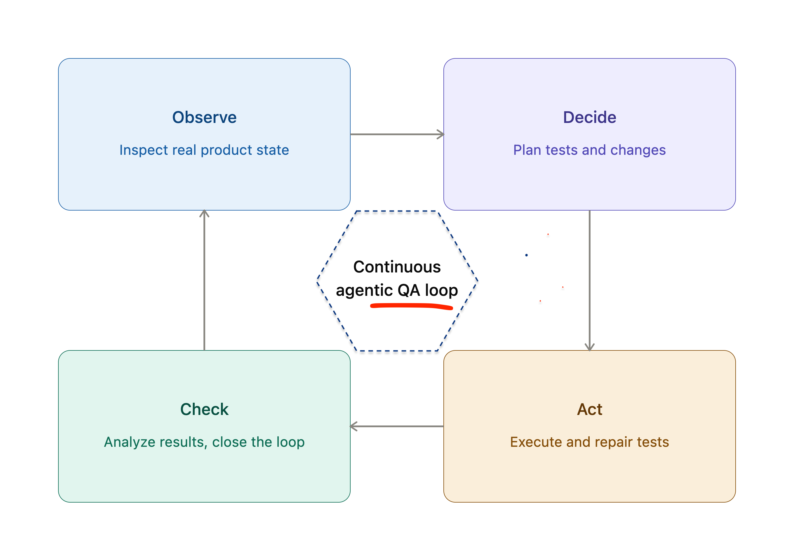
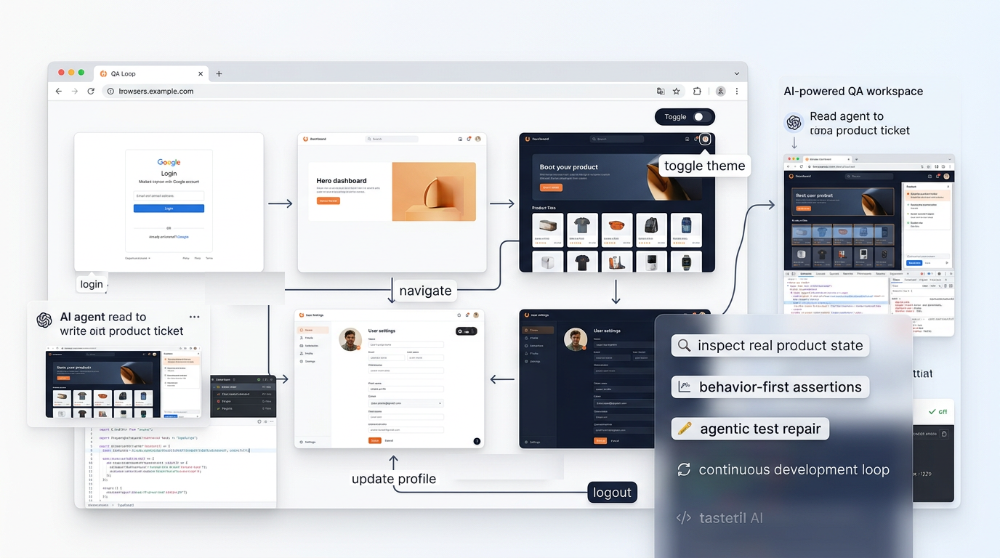

# QA Loop in Agentic AI

**QA Loop (in agentic AI)**

A `QA loop` is a repeating cycle where an AI agent tests a live product on its own. 
It looks at the product, decides what to test, runs the test, checks the result, and then uses what it learned to test again. 
This keeps repeating without a person guiding each step.

Here is an **Analogy**:

> It's like a chef who keeps tasting a soup while cooking. 
> They taste it, notice it needs more salt, adjust it, tastes again, and keeps repeating this until the soup is right, all without anyone telling them to do it.



QA Loop Studio is a development-first sample web app and test harness for building and validating user-facing product flows with Playwright.

It is meant to stay generic so the repository can expand into a larger project over time.

## Playwright MCP

Playwright MCP connects your AI tool to a live browser session through the Model Context Protocol.
It gives the agent a real view of the page so it can inspect state, exercise flows, catch breakages, and repair tests from what the user actually sees.

Use it as the browser layer for the QA loop in this project:

1. Start the website locally
2. Connect your MCP client to Playwright MCP
3. Let the agent inspect the UI and run tests against the live app
4. Fix failing behavior or incorrect test assumptions
5. Rerun the suite until the loop is green

### Setup guide

Add the standard Playwright MCP server config in whichever MCP client you use:

```json
{
  "mcpServers": {
    "playwright": {
      "command": "npx",
      "args": ["@playwright/mcp@latest"]
    }
  }
}
```

Most MCP clients let you add this through a UI, a config file, or a CLI command. Use the equivalent install flow for your tool of choice, then point it at the local browser session for this repo.

For a standalone HTTP server, run:

```bash
npx @playwright/mcp@latest --port 8931
```

Then point your MCP client to `http://localhost:8931/mcp`.

### Fast local loop

If you want the shortest setup with the fewest moving parts, use the built-in scripts in this repo:

Terminal 1:

```bash
npm run dev
```

Terminal 2:

```bash
npm run mcp
```

Terminal 3:

```bash
npm run test:ui
```

`npm run test:ui` opens Playwright UI Mode, where you can run tests, inspect failures, and re-run selected tests while you edit the app. The MCP server keeps the browser available for agent-driven inspection and repair.

### Demo automation loop

For a more hands-off demo, use the combined helper:

```bash
npm run qa:demo
```

This starts:

- the Vite dev server
- the Playwright MCP server
- the test watcher that reruns `npm run test:e2e` when files change

If you only want the watcher, run:

```bash
npm run qa:watch
```

The watcher is useful for showing a live QA loop:

1. Make a code change
2. The watcher reruns the tests
3. The agent sees a failure or a passing result
4. Fix the app or adjust the test
5. Repeat until the loop is green

## What this repo is about

- A simple local website with a login screen, home dashboard, profile settings, and theme toggle
- A Playwright end-to-end testing setup for behavior-first validation
- A lightweight base for continuous product iteration, QA, and agent-assisted development

## QA Loop

A QA loop is the repeatable cycle of:

1. Inspecting the real product state
2. Identifying quality risks
3. Writing or updating tests around user behavior
4. Making the code change
5. Running the tests again
6. Repeating until the feature is stable

In this repo, the QA loop is designed to support agentic and AI-assisted testing workflows where the app is checked in a browser and the tests evolve with the product.

### Agentic loop demo

The goal of this repo is to show a live cycle like this:

1. A developer edits the webpage
2. An agent uses Playwright MCP to inspect the browser state in real time
3. The agent runs the existing tests and catches broken behavior
4. If the agent chooses the wrong test or makes a bad assertion, it updates the test and reruns it
5. The developer fixes the app
6. The agent reruns the suite and confirms the behavior passes

Here is a visual explanation :



## Install and setup

If npm blocks install scripts during setup, approve the Vite dependency first:

```bash
npm install-scripts approve esbuild
```

On macOS, you can also allow the optional file watcher:

```bash
npm install-scripts approve fsevents
```

Then install the project dependencies:

```bash
npm install
```

## Run the website locally

```bash
npm run dev
```

Then open the local URL shown in the terminal.

## Run end-to-end tests

Run this in a new terminal session:

```bash
npm run test:e2e
```

For interactive debugging and rapid reruns, use:

```bash
npm run test:ui
```

To auto-rerun tests while files change:

```bash
npm run qa:watch
```

## Live web development loop

Use this flow when you want to inspect the app, make changes, and rerun tests:

```bash
npm run dev
```

In a new terminal session, run:

```bash
npm run test:e2e
```

Or use UI mode:

```bash
npm run test:ui
```

Then:

1. Make your code changes
2. Let the agent inspect the live browser via Playwright MCP
3. Run `npm run test:e2e` again, or use `npm run test:ui` for interactive reruns
4. Repeat until the behavior is correct

For the most complete demo, run:

```bash
npm run qa:demo
```

## Project direction

This repository is intentionally small at first so it can grow into a fuller product later. Good next expansion areas include:

- richer authentication flows
- more product pages
- profile persistence
- shared UI components
- broader Playwright coverage
- API integration
- CI automation
