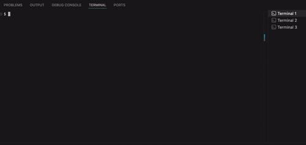

# QA Loop in Agentic AI

QA Loop Demo is a small demo web app for showing a live browser QA loop with Playwright MCP.

The idea is simple, pick your "development + testing" style:

**OPTION 1 : IN THE TEST "WE TRUST"**

1. Change the app (code).
2. Let the test catch the break.
3. Use an agent to inspect the live browser and repair the app or the test.
4. Rerun until it passes.

This option (1) is useful to catch bugs as the code changes.

<details>
<summary>Example: app code changed, test catches it</summary>

If someone changes the login heading in [src/main.tsx](/src/main.tsx) from `Sign in` to `Sign on`, the login test should fail because the visible UI no longer matches the expected behavior.

The agent should inspect the live page, confirm the heading mismatch, and make the smallest fix in the app.

Prompt:

```text
Inspect the live app through existing session of Playwright MCP. The tests are failing after a code change. Find the code change and fix so that existing test is wrong again, make the smallest fix, and let MCP rerun the login test until it passes.
```

</details>

---

**OPTION 2 : IN THE TEST "WE FIX"**

1. Change the app in a way that makes the test expectation wrong.
2. Let the test fail.
3. Use an agent to inspect the live browser and confirm the app behavior is correct.
4. Repair the test so it matches the real product behavior.
5. Rerun until it passes.

This option (2) is useful when the app is right and the test is stale, over-specific, or checking the wrong thing.

<details>
<summary>Example: test changed, agent fixes the test</summary>

If someone changes the home heading in [src/main.tsx](/src/main.tsx) from `Sell tooling with a strong first impression.` to `Sell tools with confidence.`, the app is still fine but the test expectation is now stale.

The agent should inspect the live page, confirm the new heading is the intended behavior, and update the test assertion in [/tests/*](/tests).

Prompt:

```text
The UI is correct. Fix only the failing Playwright test in `tests/*`.
Do not edit app code. Let MCP rerun the failing test until green.
```

</details>

---

<figure id="qa-loop-diagram">
  
  <figcaption>Figure 1: The QA loop cycle - inspect, detect, fix, and verify.</figcaption>
</figure>

---

<figure id="qa-loop-mcp-flow">
  
  <figcaption>Figure 2: Playwright MCP is the browser bridge that lets Codex inspect the live app and verify changes.</figcaption>
</figure>

## What this contains

- a mock login page
- a home page with 10 product tiles
- a settings page for basic profile edits
- a dark mode toggle
- Playwright tests that validate the visible behavior
- an agentic QA loop using Playwright MCP

## Setup

Have `node` installed and then install dependencies:

```bash
npm install
```

<details>[Optional steps]
<summary>If npm blocks install scripts during setup</summary>

- Approve the Vite dependency first

```bash
npm install-scripts approve esbuild
```

- On macOS, optionally allow the file watcher:

```bash
npm install-scripts approve fsevents
```

</details>

--- 

## Running the demo on local

Open a fresh Terminal session lets say:

**Terminal 1:**

```bash
npm run dev
```

**Terminal 2:**

```bash
npm run mcp
```

**Terminal 3:**

```bash
npm run qa:watch
```

----

<figure id="qa-loop-mcp-flow">
  
  <figcaption>Figure 3: Animated image showing how to run commands in 3 separate terminals.</figcaption>
</figure>


## How the loop works

- `npm run dev` serves the app at `http://127.0.0.1:5173`
- `npm run mcp` exposes the live browser at `http://localhost:8931/mcp`
- `npm run qa:watch` reruns `npm run test:e2e` when files change
- Codex inspects the live browser, decides whether the app or test is wrong, and makes the smallest fix

## Scripts

```bash
npm run dev       # start the web app
npm run mcp       # start Playwright MCP on localhost:8931
npm run test:e2e  # run Playwright tests once
npm run qa:watch  # rerun tests when files change
npm run test:ui   # open Playwright UI mode
```

## Install and setup

If npm blocks install scripts during setup, approve `esbuild` first, then run `npm install`.
